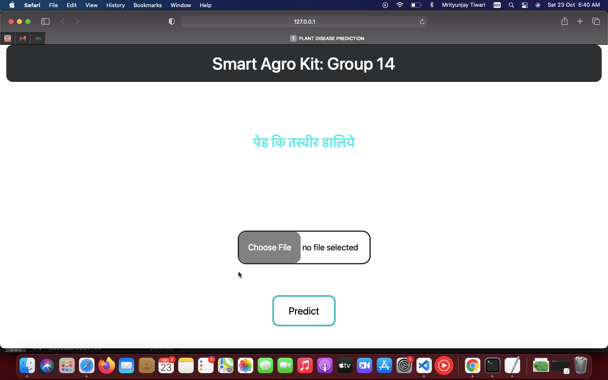
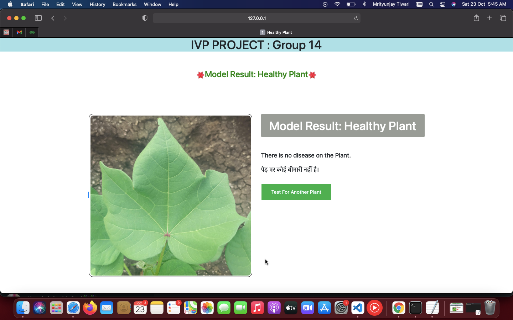
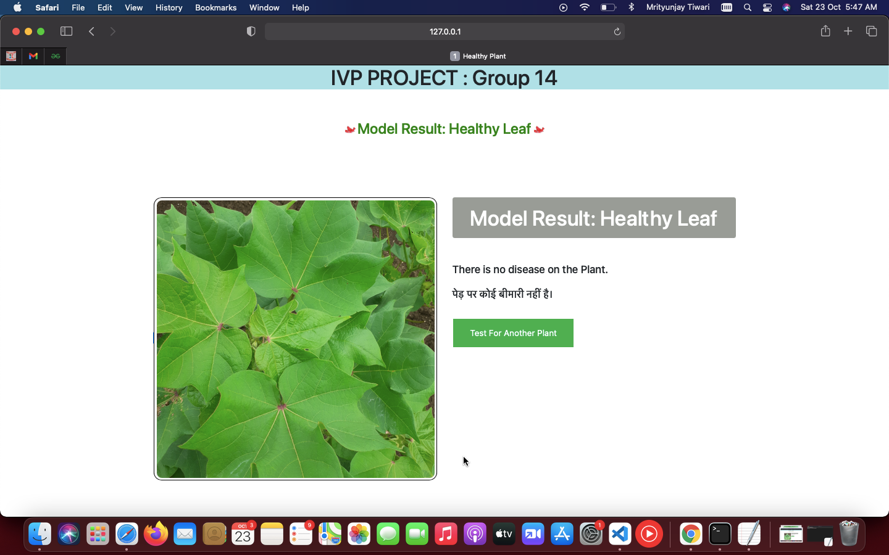
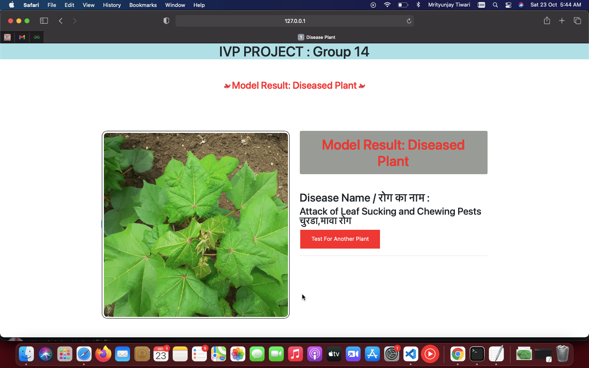
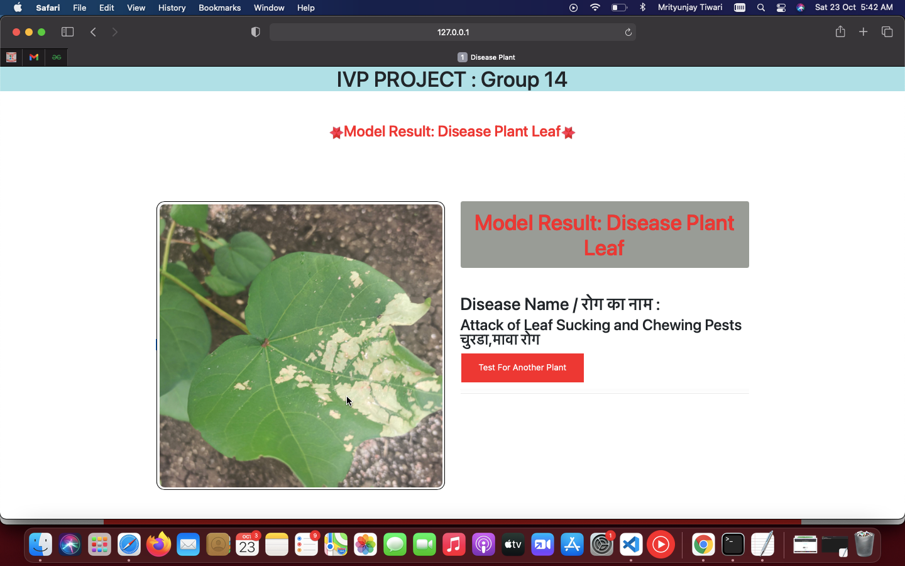
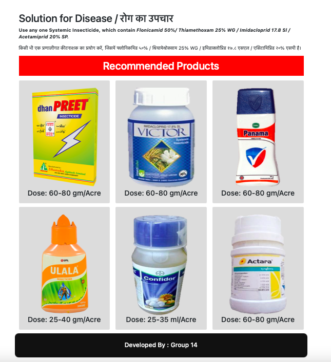

## SMART AGRO KIT


<!-- TABLE OF CONTENTS -->
<details open="open">
  <summary>Table of Contents</summary>
  <ol>
    <li>
      <a href="#about-the-project">About The Project</a>
    </li>
    <li><a href="#built-with">Built With</a></li>
    <li>
      <a href="#getting-started">Getting Started</a>
      <ul>
        <li><a href="#prerequisites">Prerequisites</a></li>
        <li><a href="#installation">Installation</a></li>
      </ul>
    </li>
    <li><a href="#How-to-use">How to use</a></li>
    <li>
      <a href="#model-predictions">Model Predictions</a>
      <ul>
        <li><a href="#when-no-disease-detected-on-plant">When no disease detected on plant</a></li>
        <li><a href="#when-no-disease-detected-on-plant-leafs">When no disease detected on plant leafs</a></li>
        <li><a href="#when-disease-detected-on-plant">When disease detected on plant</a></li>
        <li><a href="#when-disease-detected-on-plant-leafs">When disease detected on plant leafs</a></li>
        <li><a href="#Disease-cure-recommendations">Disease cure recommendations</a></li>
      </ul>
    </li>
    
  </ol>
</details>


## About The Project

In modern era many of farmers not able to predict right information due to lack of skills,time This is the reason for many crops failure. Unfortunately the farmers award with huge losses and in some case it grow to be committing suicide.In order to make their task a bit easier we have worked on a project and  developed a reliable and easy to use system for use by farmers. So for detection of diseases on crops we have proposed a smart and efficient technique by using image processing and IoT techniques, farmers need to click pictures of their crops and upload that to our webpage then the system will analyse crops and alerts with disease names as well as how to prevent them.

## Built With
<ul>
   <li>Flask</li>
   <li>Python</li>
   <li>IoT</li>
  <li>HTML</li>
  <li>CSS</li>
  <li>Javascript</li>
  <li>python</li>
</ul>


<!-- GETTING STARTED -->
## Getting Started

This is an example of how you may give instructions on setting up your project locally.
To get a local copy up and running follow these simple example steps.

### Prerequisites

This is an example of how to list things you need to use the software and how to install them.
  * Create the Virtual Environment
  ```sh
  $ python3 -m venv venv
  ```
  
  * Activate the virtual environment
  ```sh
  $ source venv/bin/activate
  ```
  
  * Install Falsk
  ```sh
  $ pip3 install Flask
  ```
  
  * Install NumPy
  ```sh
  $ python -m pip install numpy
  ```
  
  * Install Pandas
  ```sh
  $ python -m pip install pandas
  ```
  
  * Install Matplotlib
  ```sh
  $ python -m pip install matplotlib
  ```
  
  * Install OpenCV
  ```sh
  $ python -m pip install opencv-python
  ```
  
  * Install Keras
  ```sh
  $ python -m pip install keras
  ```
  
  * Install TensorFlow
  ```sh
  $ python -m pip install tensorflow
  ```
  
 ### Installation


1. Clone the repo
   ```sh
   git clone https://github.com/RedixoLabs/ML%20Part
   ```
2. Change directory to main file
   ```sh
   cd model_codes
   ```
3. Install requirements.txt
   ```sh
   pip install requirements.txt 
   ```
4. Set the FLASK_APP system variable
   ```sh
   $ export FLASK_APP=app.py
   ```
5. Run Flask
   ```sh
   $ flask run
   ```
Visit http://127.0.0.1:5000 to see your app in action 

<!-- Usage -->
## How to use
1.Go through webpage link http://127.0.0.1:5000 
<br> 

2. Tap on choose file.
3. Upload or click picture of crops.
4. Click on predict

Now system will auto show status of crops ,if disease detected it will shoe name and their cure.


<!-- Usage -->
## Model Predictions

 > ### When no disease detected on plant
  
 <br>  <br>
  
 > ### When no disease detected on plant leafs
<br>   <br>
  
 > ### When disease detected on plant
 <br>  <br>
  
 > ### When disease detected on plant leafs
 <br>  <br>
 
 > ###    Disease cure recommendations
 <br>  <br>
 
 <hr>
