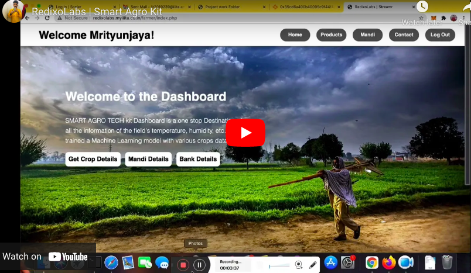

# Smart Agro Project 

-------------------
## About Project
Smart Agro Project is an IoT kit consists of several sensors that takes realtime readings from formers field and sends alerts over the text messages/email/calls to farmers when needed to act .

## DEMO
### IoT Kit Demo

 > Our model have several sensors that takes readings from farmers field through microcontroller . We've set thresold minimum and maximum values for each sensors when sensor values will be out of thresold values, then we'll send alerts.
In demo, we've used temperature & intensity sensors, here temperature value is less than the minimum thresold value, so simply we are turning on electric motor(LED for demo) and sending alerts over text message .

## Demo Video

     
### Deep Learning Model Demo

> We've set camera in our kit, that clicks photos of crops & sends to cloud . We've trained a deep learning model for detection of diseases of crops. If any disease will be detected by our model, then it will send alerts with disease name and how to prevent as well. For the demo purpose, we're manually uploading photos of crops..... 

    >> DEMO OF LANDING PAGE
   https://error404m.github.io/RedixoLabs/Deep%20Learning%20Part/templates/index.html
    
    >> DEMO OF WHEN NO DISEASE DETECTED
   https://error404m.github.io/RedixoLabs/Deep%20Learning%20Part/templates/healthy.html
    
    >> DEMO OF WHEN CROPS'S DISEASE DETECTED
   https://error404m.github.io/RedixoLabs/Deep%20Learning%20Part/templates/1.html
   
### Farmers/Banks/Mandi's Dashboard

> Now days, farmers sells thier crops at very cheap rates with mediators and farmers are not getting government scheames . For this problem we've developed a model that analyzes the expected production of crops and send data to governments , Mandis, banks, etc. iff farmers enables data sharing mode .

   https://error404m.github.io/RedixoLabs/WebD%20Part/index.html
