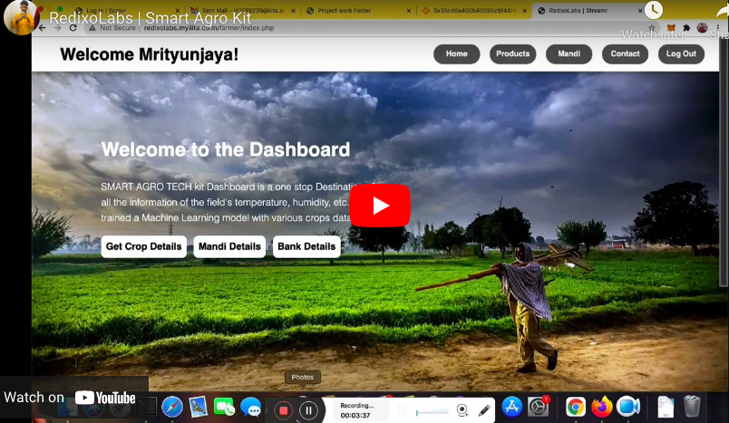

# Smart Agro Project 

-------------------
## About Project
Smart Agro Project is an IoT kit consists of several sensors that takes realtime readings from formers field and sends alerts over the text messages/email/calls to farmers when needed to act .

## Demo Video

   

   
### Farmers/Banks/Mandi's Dashboard Demo

> Now days, farmers sells thier crops at very cheap rates with mediators and farmers are not getting government scheames . For this problem we've developed a model that analyzes the expected production of crops and send data to governments , Mandis, banks, etc. iff farmers enables data sharing mode .

 https://error404m.github.io/RedixoLabs/WebD%20Part/index.html
 
 

 
 ### RedixoLabs website

 https://redixolabs.in
 
 

